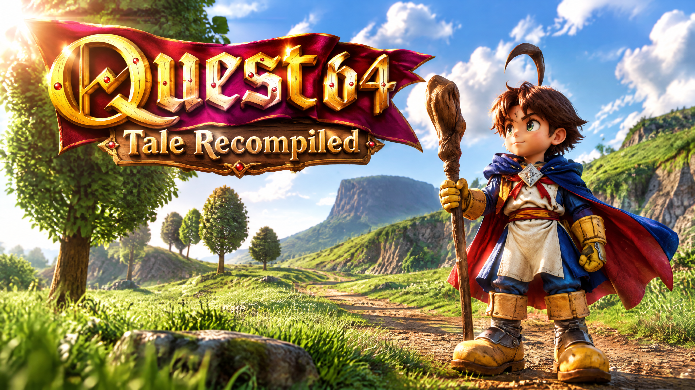

# Quest 64 Tale: Recompiled

A native Windows and Linux port of Quest 64 (USA), powered by [N64Recomp](https://github.com/N64Recomp/N64Recomp), [N64ModernRuntime](https://github.com/N64Recomp/N64ModernRuntime), and [RT64](https://github.com/rt64/rt64).

Version **1.0.7** · [Releases](https://github.com/boricuapab/quest64tale-recompiled/releases) · [Mods](https://github.com/boricuapab/quest64tale-recompiled-mods)

This repository and its game release archives contain no ROM, extracted gameplay models/textures, save files or personal settings. Supply your own original USA ROM. The maintainer-selected launcher artwork is included; gameplay assets are loaded from your ROM. Open fonts are fetched during a source build and included in release packages.

## Getting started

1. Download the Windows or Linux v1.0.7 ZIP and extract it.
2. Run `Quest64Recompiled.exe` on Windows or `Quest64Recompiled` on Linux.
3. Select your USA ROM in the launcher, then start the game.
4. Configure graphics, input bindings and mods in Settings.

The supported big-endian USA ROM SHA-1 is `91b96e938c6d91699057fad91d726ee5a23ce33a`. The launcher accepts standard N64 ROM byte orders.

## Features

- Native ROM-selection launcher and Controller Pak save support.
- Graphics resolution, anti-aliasing, aspect-ratio and rendering-rate settings.
- Keyboard and controller bindings.
- Seven optional packs: Maximum Stats, All Spells, Debug Menu, Brian textures, Auto Save, Random Encounter Rate and Enemy Health Bars on both platforms.
- Debug map/submap/entrance travel and selection of eight boss encounters.
- Supplied launcher artwork and executable-relative UI loading.

## Requirements

Windows: x64 Windows with Direct3D 12 or Vulkan support and current graphics drivers. Install the Microsoft Visual C++ 2015–2022 x64 runtime if requested.

Linux: x86-64, Vulkan support, SDL2, GTK 3, zlib, X11 and compatible C/C++ system libraries. The Linux release uses Ubuntu's system libraries; it is not a self-contained AppImage. See the release dependency list.

## Mods

Download the packs from the [separate mods repository](https://github.com/boricuapab/quest64tale-recompiled-mods). Open the launcher Mods tab, choose Open Mods Folder, copy the packs there and enable them. The texture pack changes Brian's three supplied high-resolution face images; unchanged original textures are not bundled in it.

After enabling Quest 64 Debug Menu and loading a game, open Settings → Debug. Select a boss in Boss fight and press its arrow. Complete active battles before travelling. Boss victories use the game's normal rewards and story logic; teleporting does not complete all earlier quests.

Saving while stat boosts are active records those boosted values. Use a separate save slot for experiments.

## Building

See [BUILDING.md](BUILDING.md). Dependencies are pinned as Git submodules. Generated game/RSP code, ROM-derived destination tables, private ROMs and build output remain local and are ignored by Git.

## Known limitations

- USA ROM only.
- Shadow depth and dark-material flicker adjustments need further in-game visual validation.
- Linux and Windows builds include the same source features; platform-specific gameplay checks remain useful.
- Mods in this project's custom `.qsmod` format require this application's compiled handlers.

## Credits and license

- [Rainchus/Quest64-Recomp](https://github.com/Rainchus/Quest64-Recomp) and [Quest64Syms](https://github.com/Rainchus/Quest64Syms): upstream project and symbol work.
- N64Recomp, N64ModernRuntime and RT64: recompilation, runtime and rendering.
- RmlUi, SDL2, lunasvg, FreeType, nativefiledialog-extended, LatoLatin, Noto Emoji and PromptFont.
- PromptFont by Yukari “Shinmera” Hafner, available at https://shinmera.com/promptfont.

Code is GPL-3.0; see [LICENSE](LICENSE). Third-party components retain their own licenses. This is an unofficial fan project.

New gameplay packs require v1.0.7. Enable Auto Save to record area checkpoints, then use **Restore Auto Save** in the Mods footer to recover one. Choose encounter frequency under **Random Encounter Rate → Configure**. Enemy health bars appear above visible combat enemies and bosses.

Local v1.0.8 candidates add camera-relative movement, independent Overworld/Battle bindings, right-stick orbit, Z zoom, A attack targeting and L target cycling. **Graphics → Aspect Ratio → 16:9** applies to the renderer globally; **HUD Placement** anchors the native Quest HUD within 16:9 or the full display width. XP and destination overlays use smaller layouts that adapt to the aspect ratio. In battle, **Start** opens **Return / Escape / Quit**; use A to select and B or Start to return. Escape uses native retreat cleanup without boss rewards or progression.

Optional v1.0.8 packs include **All Stats Experience**, **Story Direction Arrow**, and **Spirit Tracker**. The spirit tracker counts the current level's remaining spirits and shows a smaller orange 3D arrow toward the nearest spirit or a connecting doorway. World arrows are clipped inside the cleared gameplay viewport.

The latest local candidate fixes full-width door fades, framebuffer clearing,
native HUD group alignment, readable XP bars and analog battle pause navigation.
Escape is unavailable in boss fights; Quit returns to the title menu. Battle
targets are acquired automatically and marked with brackets sized around their
bodies. Spirit Tracker includes collected/total and remaining counts.
**Spell Preview** adds native hit radius, target distance and element matchup
labels. Hit radius describes the collision area rather than projectile reach.
